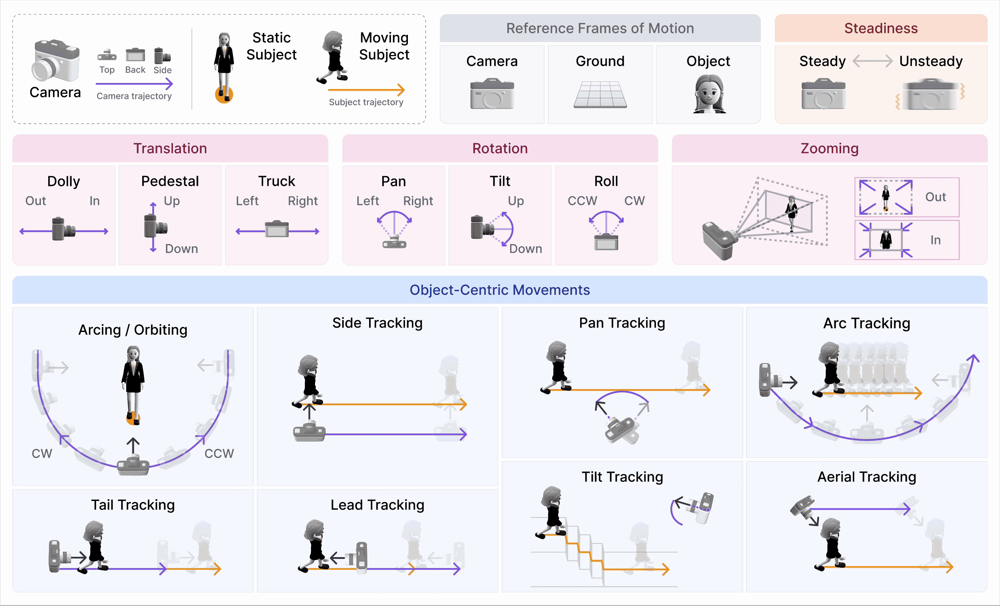

# camera-movement-gifs

Animated GIF scene libraries for AI camera movement analysis experiments.
Each folder corresponds to one source video. GIFs are auto-generated from model-detected scene cut points using [`preview_cuts.py`](preview_cuts.py).

---

## Camera Movement Reference

---

## Videos

### [`dior-ss26-jardin-luxembourg/`](dior-ss26-jardin-luxembourg/)

**Source:** [Dior Spring Summer 2026 — Jardin du Luxembourg](https://www.youtube.com/watch?v=oPR-3bB0n7M)
**Scenes:** 29 | **Total duration:** ~256s

| Scene | Start | End | Duration |
|---|---|---|---|
| 01 | 0.00s | 4.08s | 4.1s |
| 02 | 4.08s | 6.72s | 2.6s |
| 03 | 6.72s | 9.24s | 2.5s |
| 04 | 9.24s | 10.12s | 0.9s |
| 05 | 10.12s | 30.04s | 19.9s |
| 06 | 30.04s | 36.08s | 6.1s |
| 07 | 36.08s | 54.60s | 18.5s |
| 08 | 54.60s | 61.96s | 7.4s |
| 09 | 61.96s | 64.72s | 2.8s |
| 10 | 64.72s | 83.36s | 18.6s |
| 11 | 83.36s | 85.52s | 2.2s |
| 12 | 85.52s | 88.92s | 3.4s |
| 13 | 88.92s | 94.20s | 5.3s |
| 14 | 94.20s | 101.64s | 7.4s |
| 15 | 101.64s | 124.20s | 22.6s |
| 16 | 124.20s | 174.68s | 50.5s |
| 17 | 174.68s | 184.00s | 9.3s |
| 18 | 184.00s | 186.80s | 2.8s |
| 19 | 186.80s | 196.16s | 9.4s |
| 20 | 196.16s | 211.72s | 15.6s |
| 21 | 211.72s | 217.68s | 6.0s |
| 22 | 217.68s | 220.68s | 3.0s |
| 23 | 220.68s | 236.60s | 15.9s |
| 24 | 236.60s | 238.36s | 1.8s |
| 25 | 238.36s | 239.80s | 1.4s |
| 26 | 239.80s | 241.72s | 1.9s |
| 27 | 241.72s | 244.60s | 2.9s |
| 28 | 244.60s | 246.56s | 2.0s |
| 29 | 246.56s | 256.40s | 9.8s |

---

### [`bentley/`](bentley/)

**Source:** Bentley luxury car influencer reel
**Scenes:** 10 | **Total duration:** ~22s

| Shot | Start | End |
|---|---|---|
| 01 | 0.00s | 2.50s |
| 02 | 2.50s | 4.07s |
| 03 | 4.07s | 6.43s |
| 04 | 6.43s | 8.70s |
| 05 | 8.70s | 11.53s |
| 06 | 11.53s | 12.57s |
| 07 | 12.57s | 13.47s |
| 08 | 13.47s | 15.93s |
| 09 | 15.93s | 18.03s |
| 10 | 18.03s | 21.69s |
